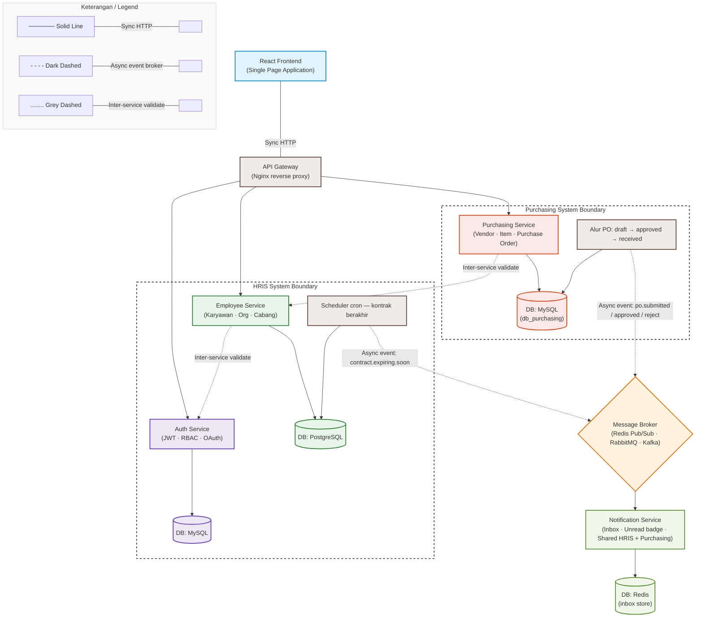

# **A. GAMBARAN SISTEM** 

Anda diminta membangun dua aplikasi microservice yang saling terintegrasi: (1) HRIS System untuk manajemen SDM dan struktur organisasi, dan (2) Purchasing System untuk manajemen vendor, item, dan purchase order antar cabang. Keduanya berbagi satu frontend React dan terhubung melalui satu API Gateway. Seluruh database menggunakan MySQL. 

# System Architecture Documentation

Arsitektur ini mengadopsi pola **Microservices** berbasis **Event-Driven Architecture** dengan pemisahan boundary yang jelas antara HRIS System dan Purchasing System, didukung oleh mekanisme sinkronisasi instan (*Sync HTTP*), validasi antar-layanan (*Inter-service validate*), dan distribusi notifikasi asinkronus (*Async event*).

## 1. System Architecture Diagram (Mermaid)

---

## 2. Updated Architectural Legend & Interface Type

| Tipe Koneksi | Representasi Visual | Implementasi Teknis | Deskripsi Fungsi |
| --- | --- | --- | --- |
| **Sync HTTP** | Garis Tegas (Solid) | REST API / HTTP 1.1 / gRPC | Digunakan untuk komunikasi *request-response* langsung. Contoh: Frontend ke API Gateway, Gateway ke core microservices, dan Notification Service ke Redis. |
| **Async event (broker)** | Garis Putus-putus Hitam | AMQP / Kafka Protocol / Redis Protocol | Komunikasi non-blocking satu arah (*Fire-and-Forget*). Produsen melepar event (`contract.expiring.soon` atau `po.status`) ke broker tanpa menunggu konsumen selesai memproses. |
| **Inter-service validate** | Garis Putus-putus Abu-abu | Internal RPC / Token Introspection / Shared Validator | Mekanisme validasi lintas *boundary*. *Purchasing Service* harus memvalidasi keabsahan data Karyawan ke *Employee Service*, dan *Employee Service* memvalidasi hak akses/token ke *Auth Service*. |

---

## 3. Boundary & Isolation Spec

* **HRIS Boundary**: Isolasi data internal kepegawaian. Perubahan skema data pada Employee dan Auth tidak boleh merusak fungsionalitas Purchasing secara langsung, kecuali yang terekspos lewat jalur *Inter-service validate*.
* **Purchasing Boundary**: Isolasi data finansial dan pengadaan. Berdiri mandiri untuk mengelola *state machine* Purchase Order (`draft` $\rightarrow$ `approved` $\rightarrow$ `received`).

**Stack Teknologi:** 

|||
|---|---|
|**Layer**|**Teknologi**|
|||
|||
|Backend Services|Laravel (PHP) atau Golang — boleh campur per service|
|||
|Frontend|React.js (wajib) — Vite / Next.js / CRA, satu SPA untuk semua modul|
|||
|||
|Database|MySQL — setiap service memiliki database (schema) sendiri yang terisolasi|
|||
|API Style|REST|
|||
|Containerization|Docker + Docker Compose|
|||
|||
|Auth|JWT, centralized di Auth Service, dikonsumsi semua service|
|||

# **B. SISTEM 1 HRIS (Human Resource Information System)** 

## **Service 1: Auth Service** 

**Database: db_auth (MySQL)  •  Port default: 8001  •  Digunakan oleh: HRIS + Purchasing** 

Centralized authentication dan authorization untuk seluruh sistem. Semua service lain memvalidasi token ke sini. 

## **Skema Database (db_auth)** 

|||||
|---|---|---|---|
|**No**|**Kolom**|**Tipe**|**Keterangan**|
|||||
|1|id|BIGINT UNSIGNED AI|Primary Key|
|||||
|2|name|VARCHAR(150)|Nama lengkap user|
|||||
|3|email|VARCHAR(150)|Unique — digunakan untuk login|
|||||
|||||
|4|password|VARCHAR(255)|Bcrypt hashed|
|||||
|5|role|ENUM|superadmin, admin_hrd, admin_cabang, karyawan, admin_purchasing, staff_purchasing|
|||||
|||||
|6|branch_id|BIGINT NULL|Cabang yang dimiliki user (referensi ke db_hrm.branches)|
|||||
|7|is_active|TINYINT(1)|1 = aktif, 0 = nonaktif|
|||||
|||||
|8|created_at|TIMESTAMP||
|||||
|||||
|9|updated_at|TIMESTAMP||
|||||

## **Fitur Wajib:** 

- POST /auth/login — email & password → JWT access token + refresh token. 

- POST /auth/refresh — perbarui access token menggunakan refresh token yang valid. 

- POST /auth/logout — invalidasi refresh token (simpan di blacklist tabel atau Redis). 

- GET /auth/me — mengembalikan profil user berdasarkan JWT (endpoint ini dipanggil service lain untuk validasi token). 

- CRUD manajemen user: tambah, lihat daftar, update role & branch_id, nonaktifkan (superadmin only). 

- Mendukung 6 role: superadmin, admin_hrd, admin_cabang, karyawan, admin_purchasing, staff_purchasing. 

## **Service 2: Employee Service** 

**Database: db_hrm (MySQL)  •  Port default: 8002  •  Scope: HRIS** 

Mengelola data master karyawan, struktur organisasi hierarki cabang dan jabatan, serta kontrak kerja karyawan. 

## **Skema Database (db_hrm)** 

## **Tabel: branches (cabang)** 

|**No**|**Kolom**|**Tipe**|**Keterangan**|
|---|---|---|---|
|||||
|1|id|BIGINT UNSIGNED AI|Primary Key|
|||||
|2|name|VARCHAR(100)|Nama cabang, contoh: Bandung, Garut, Sukabumi|
|||||
|3|code|VARCHAR(20)|Kode unik cabang (contoh: BDG, GRT, SKB)|
|||||
|4|parent_id|BIGINT NULL|FK ke branches.id — hierarki wilayah/area → cabang|
|||||
|5|address|TEXT NULL|Alamat lengkap cabang|
|||||
|6|is_active|TINYINT(1)|1 = aktif, 0 = nonaktif|
|||||
|7|created_at / updated_at|TIMESTAMP||

## **Tabel: positions (jabatan — hierarki dinamis)** 

|||||
|---|---|---|---|
|**No**|**Kolom**|**Tipe**|**Keterangan**|
|||||
|1|id|BIGINT UNSIGNED AI|Primary Key|
|||||
|2|name|VARCHAR(100)|Contoh: Staff IT, Supervisor IT, Manager IT|
|||||
|3|level|TINYINT|1=Staff, 2=Supervisor, 3=Manager, 4=Direktur|
|||||
|||||
|4|division|VARCHAR(100)|Contoh: Operasional, Supporting, Finance, IT|
|||||
|5|parent_position_id|BIGINT NULL|FK ke positions.id — hierarki atasan|
|||||
|6|branch_id|BIGINT NULL|Scope jabatan per cabang (null = global)|
|||||
|||||
|7|created_at / updated_at|TIMESTAMP||

**Tabel: employees (karyawan)** 

|||||
|---|---|---|---|
|**No**|**Kolom**|**Tipe**|**Keterangan**|
|||||
|||||
|1|id|BIGINT UNSIGNED AI|Primary Key|
|||||
|2|user_id|BIGINT UNSIGNED|Referensi ke db_auth.users (via JWT claim)|
|||||
|||||
|3|nama_lengkap|VARCHAR(150)||
|||||
|4|nomor_induk_karyawan|VARCHAR(30)|Format: YYYY.MM.XXXXX — unik|
|||||
|5|alamat|TEXT||
|||||
|6|branch_id|BIGINT UNSIGNED|FK ke branches|
|||||
|7|position_id|BIGINT UNSIGNED|FK ke positions|
|||||
|||||
|8|tanggal_gabung|DATE||
|||||
|9|tanggal_mulai_kontrak|DATE||
|||||
|||||
|10|tanggal_akhir_kontrak|DATE NULL|Null = karyawan tetap/tidak berkontrak|
|||||
|11|status|ENUM|aktif, nonaktif, kontrak_berakhir|
|||||
|12|created_at / updated_at|TIMESTAMP||

## **Fitur Wajib:** 

- CRUD data karyawan (dengan soft delete — tidak boleh hard delete). 

- CRUD cabang (branches) — mendukung hierarki parent-child (area → cabang → sub-cabang). 

- CRUD jabatan (positions) — mendukung hierarki atasan-bawahan (tree struktur). 

- GET /employees — filter by branch_id, division, level, status + paginasi. 

- GET /employees/{id}/org-tree — mengembalikan hierarki organisasi karyawan tersebut. 

- GET /branches — endpoint publik (digunakan juga oleh Purchasing Service untuk daftar cabang tujuan PO). 

- Validasi JWT di setiap request dengan memanggil GET /auth/me dari Auth Service. 

# **C. SISTEM 2 PURCHASING SYSTEM** 

Purchasing System adalah aplikasi microservice terpisah yang mengelola vendor, item/barang, dan purchase order (PO) antar cabang. Cabang yang dapat mengajukan PO berasal dari data cabang aktif di Employee Service (HRIS), sehingga kedua sistem saling terhubung. 

## **Service 3: Purchasing Service** 

**Database: db_purchasing (MySQL)  •  Port default: 8003  •  Scope: Purchasing System** 

## **Skema Database (db_purchasing)** 

**Tabel: vendors** 

|**No**|**Kolom**|**Tipe**|**Keterangan**|
|---|---|---|---|
|||||
|1|id|BIGINT UNSIGNED AI|Primary Key|
|||||

|**No**|**Kolom**|**Tipe**|**Keterangan**|
|---|---|---|---|
|||||
|||||
|2|name|VARCHAR(150)|Nama vendor/supplier|
|||||
|||||
|3|code|VARCHAR(30)|Kode unik vendor (contoh: VND-001)|
|||||
|4|contact_person|VARCHAR(100)|Nama PIC vendor|
|||||
|||||
|5|phone|VARCHAR(30)|Nomor telepon vendor|
|||||
|6|email|VARCHAR(150) NULL|Email vendor|
|||||
|7|address|TEXT|Alamat lengkap vendor|
|||||
|||||
|8|npwp|VARCHAR(30) NULL|Nomor NPWP vendor|
|||||
|9|payment_term_days|SMALLINT|Jangka waktu pembayaran (contoh: 30 hari)|
|||||
|||||
|10|is_active|TINYINT(1)|1 = aktif, 0 = nonaktif|
|||||
|11|created_at / updated_at|TIMESTAMP||
|||||

## **Tabel: items (master barang)** 

|**No**|**Kolom**|**Tipe**|**Keterangan**|
|---|---|---|---|
|||||
|1|id|BIGINT UNSIGNED AI|Primary Key|
|||||
|2|code|VARCHAR(50)|Kode unik item (contoh: ITM-0001)|
|||||
|3|name|VARCHAR(200)|Nama barang|
|||||
|4|description|TEXT NULL|Deskripsi barang|
|||||
|5|category|VARCHAR(100)|Kategori (contoh: ATK, Elektronik, Furnitur, Kebersihan)|
|||||
|6|unit|VARCHAR(30)|Satuan: pcs, box, rim, unit, kg, liter, dll|
|||||
|7|default_vendor_id|BIGINT UNSIGNED NULL|FK ke vendors — vendor default untuk item ini|
|||||
|||||
|8|last_price|DECIMAL(15,2) NULL|Harga terakhir dari PO sebelumnya — diperbarui otomatis saat received|
|||||
|9|is_active|TINYINT(1)|Status aktif item|
|||||
|10|created_at / updated_at|TIMESTAMP||
|||||

## **Tabel: purchase_orders** 

|**No**|**Kolom**|**Tipe**|**Keterangan**|
|---|---|---|---|
|||||
|||||
|1|id|BIGINT UNSIGNED AI|Primary Key|
|||||
|2|po_number|VARCHAR(50)|Nomor unik PO — format: PO/{KODE_CABANG}/{TAHUN}/{NOMOR_URUT}|
|||||
|||||
|3|branch_id|BIGINT UNSIGNED|ID cabang pengaju — referensi ke db_hrm.branches (logis, bukan FK fisik)|
|||||
|4|branch_name|VARCHAR(100)|Snapshot nama cabang saat PO dibuat|
|||||
|5|branch_code|VARCHAR(20)|Snapshot kode cabang saat PO dibuat|
|||||

|**No**|**Kolom**|**Tipe**|**Keterangan**|
|---|---|---|---|
|||||
|||||
|6|vendor_id|BIGINT UNSIGNED|FK ke vendors|
|||||
|||||
|7|requested_by|BIGINT UNSIGNED|user_id pengaju (dari JWT claim)|
|||||
|8|status|ENUM|draft, submitted, approved, rejected, received, cancelled|
|||||
|||||
|9|tanggal_po|DATE|Tanggal PO dibuat|
|||||
|10|tanggal_dibutuhkan|DATE NULL|Tanggal barang dibutuhkan di cabang|
|||||
|11|tanggal_pengiriman|DATE NULL|Tanggal realisasi pengiriman dari vendor|
|||||
|||||
|12|total_amount|DECIMAL(15,2)|Total nilai PO — dihitung dari po_items|
|||||
|13|catatan|TEXT NULL|Keterangan tambahan dari pengaju|
|||||
|||||
|14|rejection_reason|TEXT NULL|Alasan penolakan (wajib diisi saat rejected)|
|||||
|||||
|15|approved_by|BIGINT UNSIGNED NULL|user_id yang menyetujui PO|
|||||
|16|approved_at|TIMESTAMP NULL||
|||||
|17|created_at / updated_at|TIMESTAMP||

## **Tabel: purchase_order_items (detail item per PO)** 

|||||
|---|---|---|---|
|**No**|**Kolom**|**Tipe**|**Keterangan**|
|||||
|1|id|BIGINT UNSIGNED AI|Primary Key|
|||||
|2|purchase_order_id|BIGINT UNSIGNED|FK ke purchase_orders|
|||||
|3|item_id|BIGINT UNSIGNED|FK ke items|
|||||
|4|item_name|VARCHAR(200)|Snapshot nama item saat PO dibuat|
|||||
|5|quantity|DECIMAL(10,2)|Jumlah barang yang dipesan|
|||||
|||||
|6|unit|VARCHAR(30)|Satuan (snapshot dari items.unit)|
|||||
|7|unit_price|DECIMAL(15,2)|Harga satuan yang disepakati|
|||||
|||||
|8|subtotal|DECIMAL(15,2)|quantity × unit_price — dihitung otomatis|
|||||
|9|notes|TEXT NULL|Catatan tambahan per item|

## **Fitur Wajib — Purchasing Service:** 

## **Manajemen Vendor** 

- CRUD vendor (Create, Read, Update, nonaktifkan — no hard delete). 

- GET /vendors — list dengan filter is_active, search by name/code + paginasi. 

- GET /vendors/{id}/purchase-history — riwayat PO yang pernah ke vendor ini. 

## **Manajemen Item** 

- CRUD item/barang. 

- GET /items — filter by category, is_active, search by name/code + paginasi. 

- Saat PO berstatus received, sistem otomatis memperbarui items.last_price dengan harga unit_price dari PO tersebut. 

## **Manajemen Purchase Order** 

- Alur status PO yang wajib diimplementasi: 

   - draft → PO masih bisa diedit, belum dikirim ke approval. 

   - submitted → PO dikirim untuk approval, tidak bisa diedit lagi. 

   - approved → Admin purchasing menyetujui PO. 

   - rejected → Admin purchasing menolak (wajib isi rejection_reason). 

   - received → Cabang mengkonfirmasi barang sudah diterima. 

   - cancelled → PO dibatalkan (hanya dari status draft atau submitted). 

- POST /purchase-orders — buat PO baru (status: draft), pilih cabang dari daftar cabang aktif HRIS. 

- PUT /purchase-orders/{id}/items — tambah/edit/hapus item di PO (hanya saat status draft). 

- PATCH /purchase-orders/{id}/submit — ubah status ke submitted. 

- PATCH /purchase-orders/{id}/approve — admin_purchasing approve. 

- PATCH /purchase-orders/{id}/reject — admin_purchasing reject, wajib isi alasan. 

- PATCH /purchase-orders/{id}/receive — cabang konfirmasi barang diterima. 

- PATCH /purchase-orders/{id}/cancel — batalkan PO. 

- GET /purchase-orders — filter by status, branch_id, vendor_id, date range + paginasi. 

- GET /purchase-orders/{id} — detail PO beserta seluruh item di dalamnya. 

- Nomor PO digenerate otomatis: PO/{KODE_CABANG}/{TAHUN}/{NOMOR_URUT} — contoh: PO/BDG/2026/0001. 

- Hak akses berbasis role: 

   - staff_purchasing / admin_cabang: hanya bisa buat dan lihat PO milik cabangnya sendiri. 

   - admin_purchasing: bisa approve/reject semua PO, lihat semua PO semua cabang. 

   - ◦ superadmin: akses penuh ke semua data. 

## **Integrasi dengan HRIS (Employee Service)** 

- Saat membuat PO, Purchasing Service memanggil GET /branches dari Employee Service untuk mendapatkan daftar cabang aktif. 

- Nama dan kode cabang disimpan sebagai snapshot (branch_name, branch_code) di tabel purchase_orders agar data PO tidak berubah jika cabang diedit di HRIS. 

- Validasi JWT di setiap request dengan memanggil GET /auth/me dari Auth Service. 

## **— E. FRONTEND (React.js 1 SPA untuk Semua Sistem)** 

Satu Single Page Application yang memuat modul HRIS dan Purchasing, dengan navigasi sidebar dan route guard berbasis role. 

## **Modul HRIS** 

## **1. Dashboard HRIS** 

- Statistik ringkas: total karyawan aktif, total cabang, breakdown karyawan per divisi. 

- Daftar karyawan yang kontraknya berakhir dalam 30 hari ke depan. 

## **2. Manajemen Karyawan** 

- Tabel daftar karyawan — filter by cabang, divisi, level, status + paginasi. 

- Form tambah / edit karyawan (modal atau halaman terpisah). 

- Halaman detail karyawan: informasi lengkap + org-tree hierarki jabatan. 

## **3. Manajemen Organisasi** 

- CRUD cabang (branches) dengan tampilan hierarki tree (parent-child). 

- CRUD jabatan (positions) dengan tampilan hierarki tree (atasan-bawahan). 

## **4. Manajemen User (superadmin only)** 

- CRUD user akun — assign role dan branch_id. 

- Nonaktifkan / aktifkan akun user. 

## **Modul Purchasing** 

## **5. Dashboard Purchasing** 

- Statistik: total PO bulan ini, PO pending approval, total nilai PO, breakdown PO per status. 

- Tabel PO terbaru dengan status badge berwarna (draft=abu, submitted=biru, approved=hijau, rejected=merah, received=teal, cancelled=gelap). 

## **6. Manajemen Vendor** 

- Tabel daftar vendor — search by name/code, filter is_active + paginasi. 

- Form tambah / edit vendor. 

- Halaman detail vendor: informasi lengkap + riwayat PO yang pernah ke vendor ini. 

## **7. Manajemen Item** 

- Tabel daftar item — filter by category, is_active, search + paginasi. 

- Form tambah / edit item — termasuk pilih default vendor dari dropdown. 

- Tampilkan last_price dari PO terakhir di tabel/detail item. 

## **8. Manajemen Purchase Order** 

- Tabel semua PO — filter by status, cabang, vendor, tanggal range + paginasi. 

- Form buat PO baru: 

   - Pilih cabang dari dropdown (data real-time dari Employee Service HRIS). 

   - Pilih vendor dari dropdown. 

   - Tambah item secara dinamis: pilih item, isi qty dan harga satuan, subtotal dihitung otomatis. 

   - Total amount dihitung otomatis dari semua baris item. 

- Halaman detail PO: tampilkan semua info PO + tabel item + tombol aksi sesuai status & role. 

- Tombol aksi muncul kondisional sesuai status PO dan role user yang login: 

   - Draft: tombol Edit Items, Submit, Cancel. 

   - Submitted: tombol Approve, Reject (admin_purchasing), Cancel (pengaju). 

   - Approved: tombol Receive (admin_cabang / staff_purchasing cabang terkait). 

## **Ketentuan Teknis Frontend:** 

- Route guard per role — tampilkan menu dan halaman sesuai role user yang login. 

- Handling error: 401 → redirect ke halaman login, 403 → tampilkan halaman forbidden, 5xx → tampilkan pesan error. 

- Auto-refresh JWT menggunakan refresh token sebelum access token expired. 

- Gunakan React Context atau Redux/Zustand untuk state management auth global. 

## **F. KOMUNIKASI ANTAR SERVICE** 

_Semua komunikasi antar-service bersifat synchronous (HTTP REST). Tidak ada message broker. Setiap service memanggil service lain secara langsung menggunakan HTTP request._ 

## **Peta Komunikasi:** 

|**Dari Service**|**Ke Service**|**Tujuan**|
|---|---|---|
||||
||||
|Employee Service|Auth Service|Validasi JWT token di setiap request masuk|
||||
|Purchasing Service|Auth Service|Validasi JWT token di setiap request masuk|
||||
|Purchasing Service|Employee Service|Ambil daftar cabang aktif saat membuat PO|
||||
|React Frontend|Auth Service|Login, logout, refresh token|
||||
|React Frontend|Employee Service|CRUD karyawan, cabang, jabatan, org-tree|
||||
|React Frontend|Purchasing Service|CRUD vendor, item, PO + workflow approval|
||||

